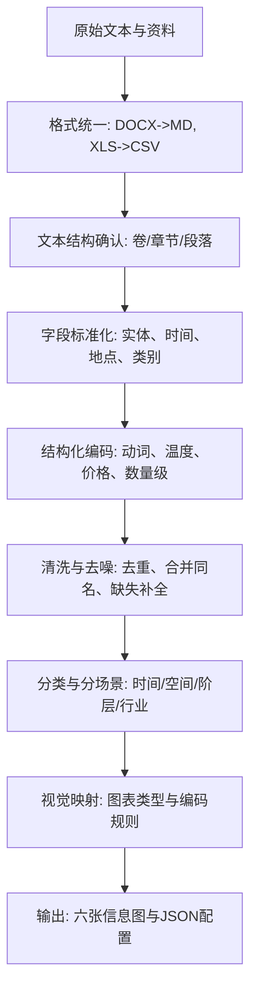

# 汴京烟火项目全流程总报告

版本日期：2026-05-24

## 1. 报告目的与论文价值

本报告用于论文写作的“方法与过程”章节，完整复盘《汴京烟火：〈东京梦华录〉信息可视化设计》从原始文本到最终六张信息图的全过程。重点包括：文本清洗、数据搜集、文本筛选、内容清洗、信息分类梳理、数据迭代与设计决策的证据链。报告以“过程可追溯、方法可复用、结论可验证”为目标，避免只给目录指向，而是直接写明做了什么、为什么这样做、做完得到什么。

---

## 2. 项目总体结构

### 2.1 项目定位

以《东京梦华录》为唯一叙事母体，构建“原典-注释-学术研究”三层证据链，将古文叙事转译为结构化可视化数据，进而完成信息图体系化输出。视觉产出为六张信息图：

1. 汴河晨食
2. 相国万货
3. 锦绣衣冠
4. 瓦舍百戏
5. 州桥夜食
6. 岁时节序

### 2.2 叙事框架

叙事从“城市时间与空间秩序”展开，形成“早市-午间-午后-夜市-节庆”的时间链，并引入空间节点（河道、城门、寺庙、桥梁）、阶层结构与行业活动，确保每一张图都具备明确的主叙事与可验证的数据支撑。

---

## 3. 数据来源与证据链构建

### 3.1 原始文本与注释底本

- 原典：东京梦华录完整文本（序 + 卷一至卷十）
- 注释：东京梦华录注（伊永文笺注）

处理原则：所有可视化的数据节点必须能回溯到原文条目；若出现解释性信息，则必须在注释或学术研究中找到支撑。

### 3.2 学术研究与方法支撑

文献审计完成 31 份学术论文与专著，主要覆盖宋代城市商业、饮食结构、服饰制度、夜市与娱乐空间、节庆仪式与社会结构。方法层面引入叙事性可视化、信息架构（LATCH）、图表语法与数据-墨水比等原则，形成“学术证据 + 可视化方法”的双支撑。

---

## 4. 数据工程与清洗流程

### 4.1 数据管线全貌（流程图）

### 4.2 格式规范化与文件治理（Phase 1）

在项目启动时存在大量 Word 与 Excel 文件，格式不符合“MD/CSV 可追溯”的要求，因此先进行全量格式转换与目录治理。

| 操作 | 输入 | 输出 | 关键结果 |
| --- | --- | --- | --- |
| Word 转 Markdown | 9 份 DOCX | 9 份 MD | 全量转为 UTF-8，结构统一 |
| XLS 转 CSV | 2 份 XLS | 2 份 CSV | 统一 UTF-8-sig，符合 CSV 标准 |
| 目录规范化 | 原始混合目录 | 维度目录 | 建立按维度分区的清洗目录 |
| 质量审计 | 无 | QA 记录 | 记录格式违规与命名异常 |

关键发现：

- “饮食.xls”实际为城市空间数据，需归入空间维度。
- “新建 XLS 工作表.xls”实际上是饮食名录表，需要重命名并归类。

### 4.3 文本筛选与方法升级（Phase 2）

在早期阶段使用“关键词出现频次法”统计食物与行业数量，答辩反馈指出频次无法代表作者意图或社会结构。因此方法升级为“场景分类法”，将文本按语境划分为“正店、脚店、食店、夜市”等类别，并以学术研究作为校验。

方法变化表：

| 维度 | 初期方法 | 问题 | 升级后方法 | 修正效果 |
| --- | --- | --- | --- | --- |
| 饮食统计 | 关键词频次 | 语境失真 | 场景分类法 | 能区分“正店贵菜”与“夜市常食” |
| 人群定位 | 广泛泛人群 | 缺乏落地 | 18-35 文旅人群 + 宋韵爱好者 | 明确受众与传播渠道 |
| 视觉风格 | 清明上河图式 | 易被解读为转译 | 现代信息设计 + 宋代语汇 | 形成自有风格 |

### 4.4 定稿结构与数据补齐（Phase 3）

定稿阶段将五张图优化为“人物主角化 + 空间纵轴”叙事结构，并明确五类数据补齐任务：

| 补齐任务 | 对应图 | 缺口类型 | 处理策略 |
| --- | --- | --- | --- |
| 鬼市与夜市 | 图二/图五 | 时间-业态细节 | 以原文时辰词建立锚点 |
| 声景数据 | 图一/图四 | 感官类描述 | 转为声波或强度图示 |
| 性别与阶层 | 图三 | 角色与服饰层级 | 以御街纵轴进行对照 |
| 外卖系统 | 图五 | 物流与器物 | 以“梅红匣儿/温盘”构成链路 |
| 元宵节庆 | 图六 | 宏观节庆系统 | 建立节庆对比矩阵 |

---

## 5. 文本清洗与结构化规则

### 5.1 清洗目标

将古文描述转为可量化、可比对、可视化的数据条目，同时保留原文证据链。核心目标是降低“描述性文本”对可视化设计的不确定性。

### 5.2 字段规范（字段字典原型）

| 字段 | 说明 | 示例 |
| --- | --- | --- |
| 原文摘录 | 直接可回溯的原句 | “夜市直至三更尽” |
| 实体对象 | 人物/食物/建筑/器物 | 旋煎羊白肠、宣德楼 |
| 场景类别 | 正店/脚店/夜市等 | 夜市 |
| 时间/季节 | 时辰、节日、季节 | 三更、夏月 |
| 空间坐标 | 城门/街巷/寺庙等 | 南薰门、州桥 |
| 行为动词 | 烹饪或行为动词 | 煎、蒸、炙 |
| 规模/频率 | 量级或强度 | “动即百数”=高 |
| 可信度 | 原文/注释/学术 | 原文 |

### 5.3 量化映射规则

将“万、千、百、不可胜数”等规模词汇转为等级区间，用于绘制“热度/强度”图；对缺乏明确数字但描述强烈的条目，标注为“高强度描述”，用于视觉权重提升但不作为精确数值。

---

## 6. 信息分类与数据结构

### 6.1 维度分层

- 时间维度：时辰（五更、三更等）、节庆月份、昼夜节律
- 空间维度：城门、河道、桥梁、寺庙、街巷
- 人群维度：官员、士人、商贾、平民、伎女等
- 物象维度：饮食、服饰、器物、娱乐项目
- 行为维度：烹饪动词、交易行为、仪式动作

### 6.2 数据规模与密度

- 结构化表格：31 个 CSV，共 616 条记录
- 夜市动词表：80 种食物、6 类动词、6 类温度
- 瓦舍百戏：39 种演艺条目、3 大类 27 子类
- 节庆条目：17 组节庆动线条目

---

## 7. 版本演进与设计迭代

### 7.1 叙事结构演变

| 阶段 | 叙事重心 | 结构变化 | 产出结果 |
| --- | --- | --- | --- |
| 2 月前初稿 | 空间骨架 | 城与巷/晨与昏 | 强调河道与城门 |
| 3 月方案 | 时间与场景 | 日-夜-节庆串联 | 引入时辰与声景 |
| 4 月定稿 | 主角化叙事 | 男女双线 + 御街纵轴 | 强化阶层与行为对照 |

### 7.2 答辩反馈驱动的修订表

| 反馈问题 | 风险 | 修订动作 | 最终体现 |
| --- | --- | --- | --- |
| 羊肉比例如何确定 | 统计逻辑不足 | 引入场景分类法 | 饮食图按场景分布 |
| 受众过于宽泛 | 传播无焦点 | 聚焦 18-35 文旅与宋韵爱好者 | 输出导览与展示方向 |
| 器皿缺失 | 宋韵不足 | 增加器型图谱 | 饮食与礼仪信息图层 |
| 清明上河图风险 | 设计同质化 | 建立自有视觉语言 | 形成现代信息设计风格 |

---

## 8. 六张信息图的数据与叙事对应

| 图名 | 主叙事 | 核心数据类别 | 视觉主件 |
| --- | --- | --- | --- |
| 汴河晨食 | 城市清晨物流与早餐生态 | 早市食物、摊位、时辰 | 河岸早市与摊铺场景 |
| 相国万货 | 相国寺商贸结构 | 商品类别、空间层级 | 市集分区与货物矩阵 |
| 锦绣衣冠 | 服饰阶层与规制 | 服饰分类、颜色禁令 | 服饰拆解与阶层对照 |
| 瓦舍百戏 | 市民娱乐产业 | 百戏项目、艺人类型 | 演艺矩阵与场景剖面 |
| 州桥夜食 | 夜市饮食与外卖系统 | 夜市菜品、温度与动词 | 夜市矩阵与物流路径 |
| 岁时节序 | 年度节庆与社会秩序 | 节庆日历、活动类型 | 节令矩阵与对比图 |

---

## 9. 关键问题与解决路径

| 问题 | 影响 | 解决方式 | 结果 |
| --- | --- | --- | --- |
| 文档格式不合规 | 无法追溯 | DOCX/XLS 转 MD/CSV | 全量统一格式 |
| 数据归类错误 | 维度混乱 | 重新识别与归类 | 空间与饮食分离 |
| 统计偏差 | 叙事误导 | 频次法升级为场景法 | 语境准确度提升 |
| 视觉同质化风险 | 设计辨识度低 | 建立宋代语汇 + 现代图表 | 形成自有系统 |
| 数据缺口 | 图表不完整 | 五项数据补齐任务 | 定稿可视化完成 |

---

## 10. 成果与可复用价值

- 完成六张信息图最终版及配套数据体系
- 建立可复用的“古文-结构化数据-可视化”流程模型
- 为论文提供完整方法论与证据链素材

---

## 11. 术语表与字段字典

### 11.1 术语表

| 术语 | 含义 |
| --- | --- |
| 场景分类法 | 以“正店/脚店/夜市”等语境切分数据 |
| 频次法 | 仅以关键词出现次数计量的方法 |
| 证据链 | 原文-注释-学术三层验证 |
| 视觉映射 | 数据字段到图形编码规则 |
| 热度指数 | 以描述强度映射的相对等级 |

### 11.2 字段字典（论文可直接引用）

| 字段 | 说明 | 数据类型 | 备注 |
| --- | --- | --- | --- |
| source_text | 原文摘录 | 文本 | 必须可回溯 |
| entity | 实体对象 | 文本 | 食物/建筑/人物 |
| scene | 场景类别 | 枚举 | 正店/脚店/夜市 |
| time | 时间/季节 | 文本 | 时辰/节日 |
| location | 空间坐标 | 文本 | 城门/寺庙/桥 |
| action | 行为动词 | 文本 | 煎/蒸/炙 |
| scale | 规模/频率 | 等级 | 低/中/高 |
| evidence | 证据来源 | 枚举 | 原文/注释/论文 |

---

## 12. 文件索引（用于论文引用）

- 原典文本：[01_Original_Data/dongjing_full.md](01_Original_Data/dongjing_full.md)
- 数据清洗日志：[operation_log.md](operation_log.md)
- 数据工程方法：[02_Data_Engineering.md](02_Data_Engineering.md)
- 叙事演进报告：[03_Narrative_Logic_Evolution.md](03_Narrative_Logic_Evolution.md)
- 最终分析报告：[最终完成稿+分析/完成稿学术分析报告.md](最终完成稿+分析/完成稿学术分析报告.md)
- JSON 配置集：[最终完成稿+分析/最终全套json.md](最终完成稿+分析/最终全套json.md)
